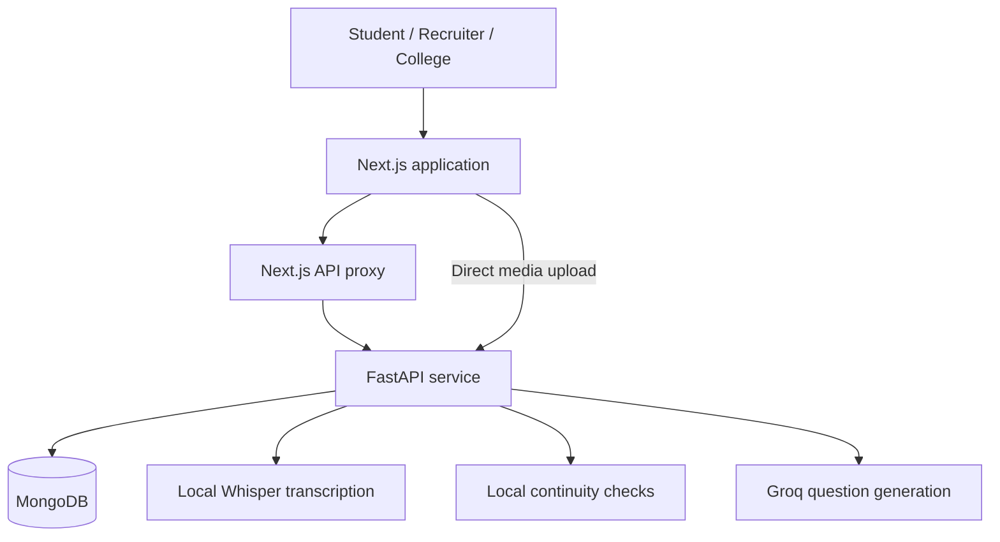

# AI Recruitment Platform

An end-to-end talent intelligence and recruitment platform for students, recruiters, companies, and colleges. The application combines resume analysis, skills-based candidate matching, structured video interviews, explainable evaluation, and placement analytics in one workflow.

**Live application:** [ai-recruitment-platform-kappa.vercel.app](https://ai-recruitment-platform-kappa.vercel.app/)

## Overview

The platform is designed to make early-career recruitment more structured and transparent. Students build a verified profile and complete guided assessments; recruiters publish roles, discover suitable candidates, and manage decisions; colleges monitor placement activity across cohorts.

The system uses a Next.js frontend, a FastAPI backend, and MongoDB. Standard browser requests pass through a Next.js API proxy, while video recordings upload directly to FastAPI to avoid serverless request-size limits.

## Key features

### Student portal

- Profile creation and secure password sign-in
- Resume upload, parsing, ATS-readiness analysis, and profile enrichment
- Persistent resume builder with education, experience, projects, and skills
- Guided 60–90 second self-introduction recording
- Local speech transcription and structured introduction analysis
- Mock interviews with recorded responses and explainable scoring
- Company-specific adaptive interviews
- Job discovery, applications, invitations, and progress tracking
- Published interview results and final hiring decisions
- Career guidance and mentorship resources

### Recruiter and company portal

- Job creation with role, skills, branch, CGPA, and eligibility requirements
- Skills-based candidate ranking and automatic invitation workflow
- Applicant review across every recruitment stage
- Adaptive, job-grounded AI interview questions
- Structured competency assessment and interview summaries
- Hiring, rejection, and result-publication workflows

### College portal

- College and cohort selection
- Placement funnel insights for applications, interviews, offers, and rejections
- Student-level progress visibility
- Consolidated placement analytics for participating cohorts

## Recruitment workflow


The backend enforces the required interview order. A student must first create a profile and analyze a resume, then complete the guided self-introduction before starting recorded interviews.

## Adaptive interview design

Company interviews ask one question at a time. The first question is grounded in the selected job description. After each answer, the backend:

1. Validates face continuity against the student's enrolled reference.
2. Transcribes the response locally using Whisper.
3. Sends only the job description, required skills, previous questions, and answer transcripts to the configured language model.
4. Validates the generated question for relevance, repetition, structure, and protected topics.
5. Falls back to a deterministic job-description question if the external model is unavailable.

Resume files, video recordings, face references, and other identity data are not sent to the question-generation provider. Final scoring remains part of the local, explainable recruiter evaluation.

## Candidate matching

Recruiters can find matching students for a published role. Eligibility considers CGPA, branch, required skills, and resume availability. Qualified candidates are ranked using:

- Required skills found in the student profile or resume: **70%**
- Resume ATS readiness: **30%**

Recruiters can invite an individual student or all qualified matches. Invited students follow the same interview and decision workflow as direct applicants.

## Technology stack

| Layer | Technology |
| --- | --- |
| Frontend | Next.js 16, React 19, TypeScript, Tailwind CSS |
| Backend | FastAPI, Python, Pydantic, Uvicorn |
| Database | MongoDB with PyMongo |
| Resume processing | PyMuPDF |
| Speech processing | Faster Whisper |
| Media and identity continuity | OpenCV, NumPy, PyAV |
| AI question generation | Groq API with a configurable model |
| Deployment | Vercel frontend, Render backend |

## Architecture



## Project structure

```text
AI_Recruitment_Platform/
├── backend/
│   ├── app/
│   │   ├── routes/                 # Student, job, application and interview APIs
│   │   ├── adaptive_interview_service.py
│   │   ├── ai_interview_service.py
│   │   ├── identity_verification_service.py
│   │   ├── identity_workflow.py
│   │   ├── self_introduction_service.py
│   │   ├── models.py
│   │   └── main.py
│   ├── tests/
│   ├── requirements.txt
│   └── .env.example
├── frontend/
│   ├── app/
│   │   ├── api/                    # Backend proxy and runtime configuration
│   │   ├── student/
│   │   ├── recruiter/
│   │   ├── college/
│   │   ├── mock-interview/
│   │   ├── company-interview/
│   │   ├── self-introduction/
│   │   └── resume-builder/
│   ├── package.json
│   └── .env.local.example
└── README.md
```

## Local setup

### Prerequisites

- Python 3.11 or newer
- Node.js 20 or newer
- MongoDB connection string
- Groq API key for adaptive company interview questions

### 1. Clone the repository

```bash
git clone https://github.com/Homeasy-Automations/AI_Recruitment_Platform.git
cd AI_Recruitment_Platform
```

### 2. Configure and start the backend

```bash
cd backend
python3 -m venv venv
source venv/bin/activate
pip install -r requirements.txt
cp .env.example .env
python -m uvicorn app.main:app --reload --host 127.0.0.1 --port 8000
```

Configure `backend/.env`:

```text
MONGODB_URI=your MongoDB connection string
FRONTEND_ORIGINS=http://localhost:3000
GROQ_API_KEY=your server-side Groq API key
GROQ_MODEL=openai/gpt-oss-20b
COMPANY_INTERVIEW_MAX_QUESTIONS=5
LOCAL_WHISPER_MODEL=base.en
```

Keep API keys server-side. Never expose the Groq key through a `NEXT_PUBLIC_` environment variable.

### 3. Configure and start the frontend

In a second terminal:

```bash
cd frontend
npm install
cp .env.local.example .env.local
npm run dev
```

Configure `frontend/.env.local`:

```text
BACKEND_URL=http://127.0.0.1:8000
```

Open [http://localhost:3000](http://localhost:3000). Each portal shows `System online` when FastAPI and MongoDB are available.

## API areas

| Prefix | Responsibility |
| --- | --- |
| `/students` | Profiles, sign-in, resume analysis, links, and target roles |
| `/resume-builders` | Persistent structured resumes |
| `/self-introductions` | Guided recording, transcription, and analysis |
| `/mock-interviews` | Mock interview sessions, answers, and results |
| `/jobs` | Job creation and retrieval |
| `/applications` | Applications, invitations, matching, and decisions |
| `/company-interviews` | Adaptive interviews and recruiter evaluations |
| `/college` | College options and placement insights |

FastAPI's interactive API documentation is available locally at [http://127.0.0.1:8000/docs](http://127.0.0.1:8000/docs).

## Verification

Run backend tests:

```bash
cd backend
MONGODB_URI='mongodb://127.0.0.1:27017/unit_test' \
  venv/bin/python -m unittest discover -s tests -p 'test_*.py' -v
```

Run the backend smoke test with a reachable disposable test database:

```bash
cd backend
venv/bin/python tests/smoke_test.py
```

Validate the frontend:

```bash
cd frontend
npm run lint
npm run build
```

The configured Whisper model downloads on the first interview analysis and is reused from the local cache.

## Deployment

### Vercel

Deploy the `frontend` directory and configure:

```text
BACKEND_URL=https://your-render-service.onrender.com
```

### Render

Deploy the FastAPI backend and configure:

```text
MONGODB_URI=your MongoDB connection string
FRONTEND_ORIGINS=https://your-production-vercel-domain.vercel.app
GROQ_API_KEY=your server-side Groq API key
GROQ_MODEL=openai/gpt-oss-20b
COMPANY_INTERVIEW_MAX_QUESTIONS=5
```

`FRONTEND_ORIGINS` accepts comma-separated origins for production and preview deployments. Redeploy both services after changing environment variables.

## Privacy and production considerations

The face checker is a prototype continuity control—not legal identity verification. It performs no emotion or demographic inference. A production deployment should add:

- Explicit biometric and recording consent
- Role-based access control and signed server-side sessions
- Encryption and strict media access policies
- Defined retention and deletion schedules
- Manual review and appeal workflows
- Auditing, rate limiting, and abuse protection
- A reviewed production identity-verification provider where legally appropriate

Student passwords are stored as salted PBKDF2 hashes. The current prototype sign-in flow should be upgraded to signed sessions or access tokens before a public production launch.

## Current status

This is a working full-stack prototype intended to demonstrate a complete recruitment lifecycle. Before production use, complete a security review, privacy and consent review, scalability assessment, and accessibility audit.
